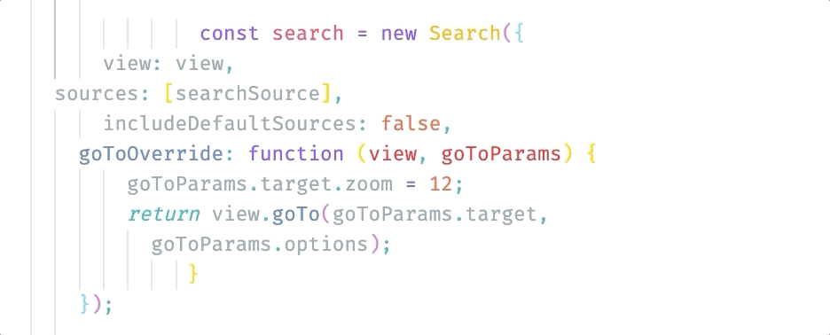
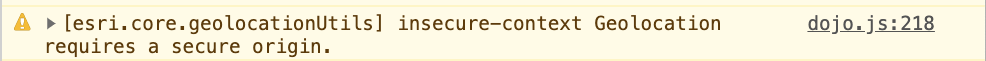
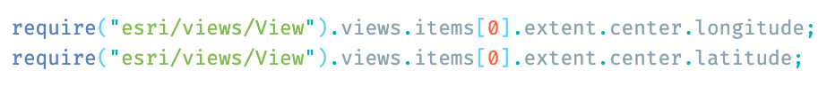
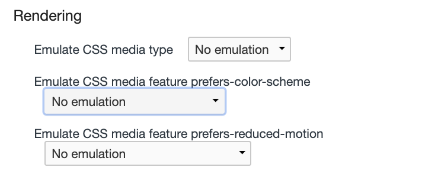
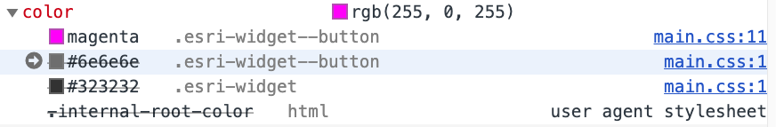

<!-- .slide: data-background="reveal.js/img/bg-1.png" -->
<!-- .slide: class="title" -->
 
 
## Webinar: Tips and Tricks for Developing and Debugging Apps
Kelly Hutchins and Heather Gonzago

----

<!-- .slide: data-background="reveal.js/img/bg-4.png" -->

----

<!-- .slide: data-background="reveal.js/img/bg-4.png" -->
 
 

### **Slides and demos can be accessed at:**

## <a href="https://shorturl.at/lrtN8" target="_blank">https://shorturl.at/lrtN8</a>

----

Ever have one of those days where nothing seems to work?

----

You keep staring at the same code, but you have nothing...

----

Debugging tools === Productive programmers
  

----
### **Things we'll discuss**
 
- Setting up your development environment
- Troubleshoot web application
- Popular browser developer tools
- Give us your questions

----

<!-- .slide: data-background="reveal.js/img/bg-3.png" -->
  
## **Setting up your development environment**

----

### **JavaScript IDE/Source code editor**
 
- Lots of choices
  - Atom, Brackets, WebStorm, Sublime, VSCode
- Debugging support
- Extensions

----

### Extensions
 - Beautify, Prettier 
 - EsLint
 - Bracket colorizer
 - Themes
  

  

----
### Font
 
  - Programming font with ligatures
  - Fira Code, Hasklig, Cascadia  

  

----

### **Code snippets/Emmet**
 

- Templates for reuseable code
- [ArcGIS API for JavaScript snippets](https://marketplace.visualstudio.com/items?itemName=Esri.arcgis-jsapi-snippets&ssr=false#overview)
- [Snippet generator](https://pawelgrzybek.com/snippet-generator/)
- - Emmett
 - Save keystrokes
 - HTML, CSS abbreviations
 - [Plug-in page](https://emmet.io/download/)

----

### **TypeScript/Babel**
 

- Code assist
- ES6
- <a href="https://developers.arcgis.com/javascript/latest/guide/typescript-setup/" target="_blank">TypeScript setup</a>

----
<!-- .slide: data-background="reveal.js/img/bg-3.png" -->

## **Demo: Code Assist**
  - Show code assist 
  - Show emmet 

----

### **Local web server**
 
- Setup IIS or Apache
  - Visit [http://localhost](http://localhost)
- Local dev server with live reload:
 - [Live Server](https://marketplace.visualstudio.com/items?itemName=ritwickdey.LiveServer)
 - [local-web-server](https://www.npmjs.com/package/local-web-server)
 - [http-server](https://www.npmjs.com/package/http-server)
<!-- .slide: data-background="reveal.js/img/bg-3.png" -->
----

### ** Starter App **
 

- TypeScript
- WebPack
- [ArcGIS API JS Template App](https://github.com/odoe/jsapi-cli-template-app)

----

<!-- .slide: data-background="reveal.js/img/bg-3.png" -->
  
## **Troubleshooting your web application**

----

### **Narrow down the problem**
 

Debugging tools can help determine:
- Is it code related?
- Is the issue on the client (API) or server?
- Is there a performance issue?
- Is the issue with the data?

----

<!-- .slide: data-background="reveal.js/img/bg-2.png" -->
## **Browser developer tools**

----
<!-- .slide: data-background="reveal.js/img/bg-2.png" -->
### **Debugging: code issues**
 
- Common examples of application-level problems:
  - Modules out of order
  - View, Map, Layer not ready
  - Typos (yes, it happens quite often)

----
<!-- .slide: data-background="reveal.js/img/bg-2.png" -->
### Modules out of order

Multiple errors can stem from wrong module order

----
<!-- .slide: data-background="reveal.js/img/bg-2.png" -->
### Not getting the results you expect

- Has the view containing the map fully loaded before executing code?
- Has the <a href= "https://developers.arcgis.com/javascript/latest/sample-code/sandbox/index.html?sample=intro-layers" target="_blank">layer</a> fully loaded before performing specific functions?

<pre style="display:inline-block; padding: 5px; margin: 10px auto; width: 100%;"><code data-trim> 
// Create a MapView instance (for 2D viewing)
var view = new MapView({
  map: myMap,  // References a Map instance
  container: "viewDiv"  // References the ID of a DOM element
});

view.when(function(){
 // All the resources in the MapView and the map have loaded. Now execute additional processes
}, function(error){
 // Use the errback function to handle when the view doesn't load properly
 console.log("The view's resources failed to load: ", error);
});

</code></pre>

----
<!-- .slide: data-background="reveal.js/img/bg-3.png" -->
 
 
### Demo: Debugging code using breakpoints

----

### ** Debugging: Network requests**

 

- Records all network requests
- Inspect network traffic if not getting the correct results, e.g.
  - Search widget not displaying properly
  - Geoprocessing task not executing as expected
  - Querying layer features
  
----
<!-- .slide: data-background="reveal.js/img/bg-3.png" -->
 
 
### Demo: Network requests

----
<!-- .slide: data-background="reveal.js/img/bg-2.png" -->
### Console

- View logged messages
  
- Run JavaScript
  
  

----

<!-- .slide: data-background="reveal.js/img/bg-2.png" -->
### CSS: Color Themes

- Detect user color scheme preferences 
  - CSS media feature (light, dark, no-preference)
- Emulate via dev tools
  
  
----
<!-- .slide: data-background="reveal.js/img/bg-2.png" -->
#### CSS: Inspect Styles  

- Inspect element css
- View classes applied to selected element

- <a target="_blank" href="https://developers.arcgis.com/javascript/latest/api-reference/esri-widgets-Search.html">View widget styles</a>

----

<!-- .slide: data-background="reveal.js/img/bg-4.png" -->
 
## Questions?
 
 
[https://github.com/hgonzago/tips-tricks-webinar](https://github.com/hgonzago/tips-tricks-webinar)