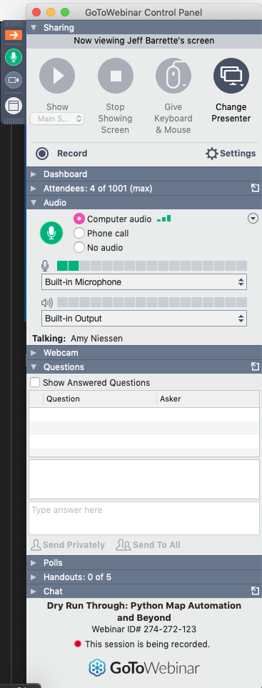
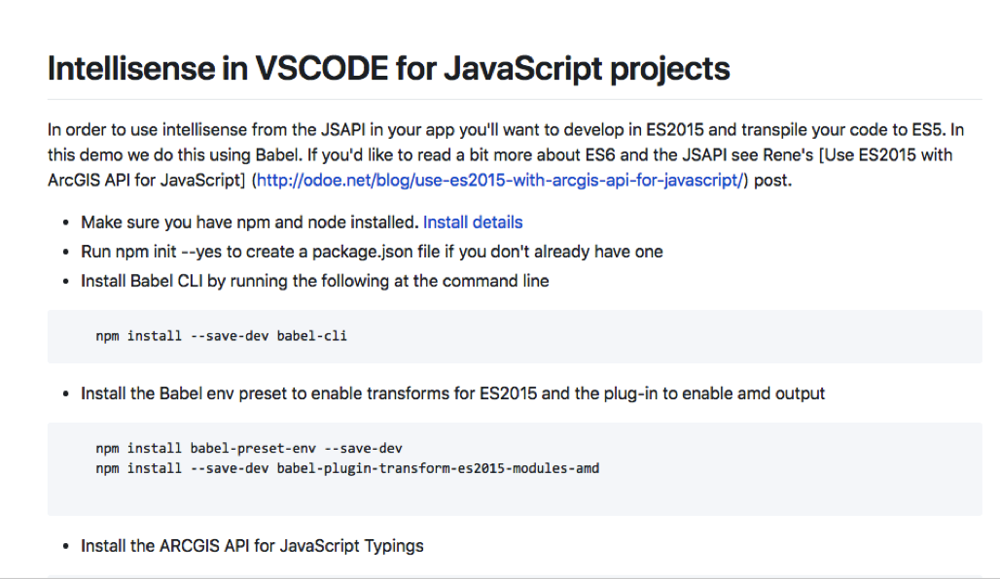
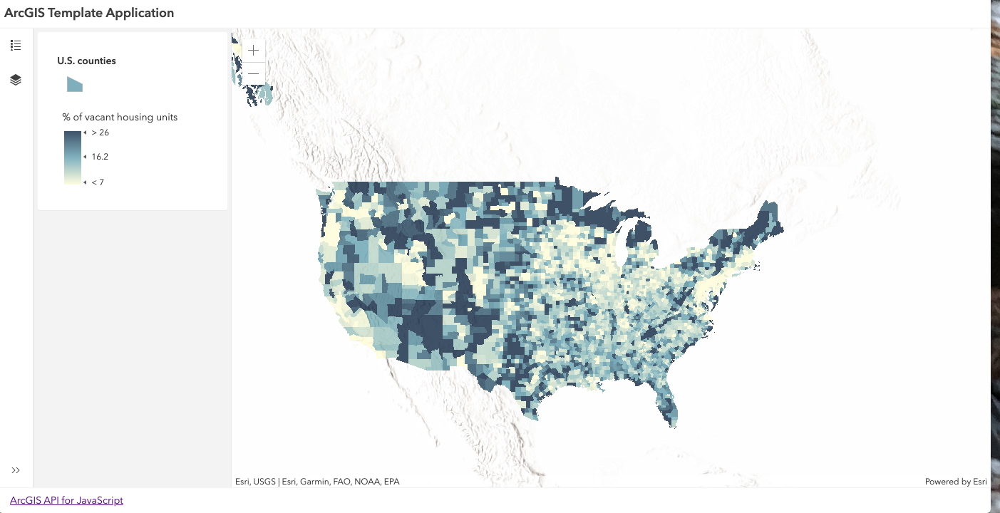
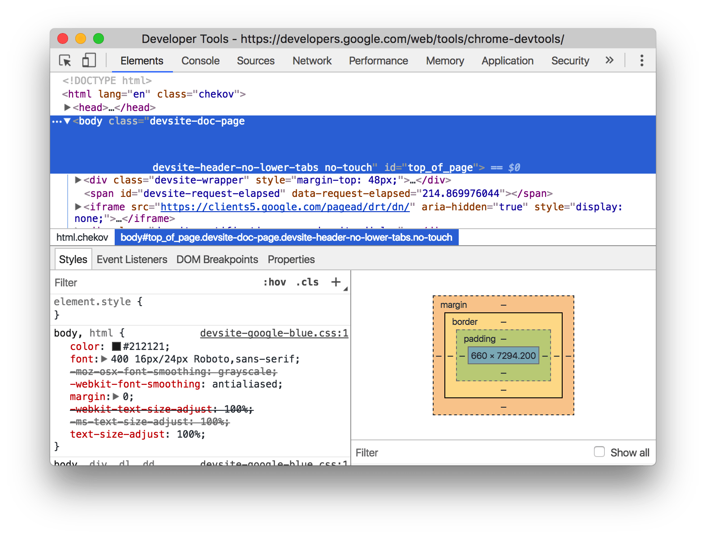
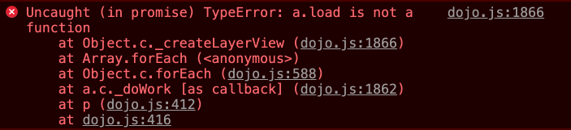
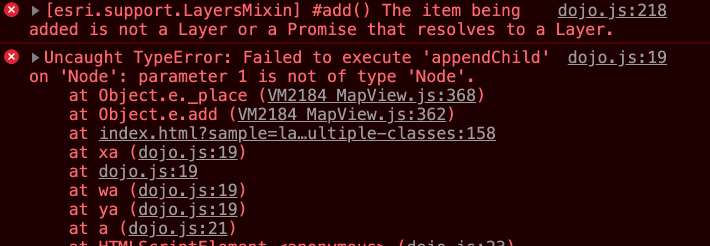
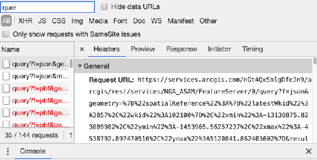
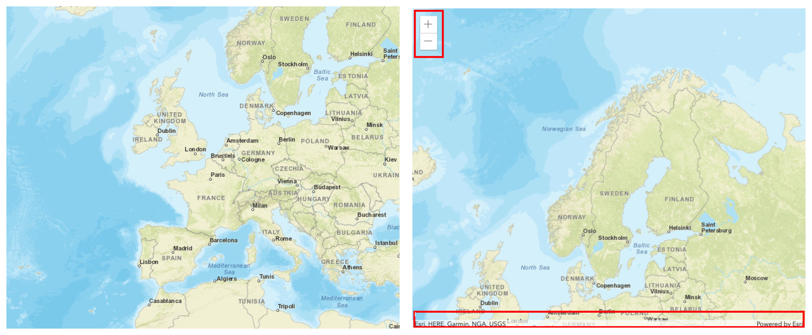

<!-- .slide: data-background="reveal.js/img/bg-1.png" -->
<!-- .slide: class="title" -->
 
 
## Webinar: Tips and Tricks for Developing and Debugging Apps
Kelly Hutchins and Heather Gonzago

----

<!-- .slide: data-background="reveal.js/img/bg-4.png" -->

----

Ever have one of those days where nothing seems to work? 

----

You keep staring at the same code, but you have nothing...

----

Debugging tools === Productive programmers

----
### **Things we'll discuss**
 

- Setting up your development environment
- Troubleshoot web application
- Popular browser developer tools

----

<!-- .slide: data-background="reveal.js/img/bg-3.png" -->
  
## **Set up your development environment**

----

### **Local web server**
 
- Setup IIS or Apache 
- Visit [http://localhost](http://localhost)
- Some examples include:
 - [Live Server](https://marketplace.visualstudio.com/items?itemName=ritwickdey.LiveServer)
 - [local-web-server](https://www.npmjs.com/package/local-web-server)
 - [http-server](https://www.npmjs.com/package/http-server)

----

### **Code snippets**

- Templates for reuseable code
- [ArcGIS API for JavaScript snippets](https://marketplace.visualstudio.com/items?itemName=Esri.arcgis-jsapi-snippets&ssr=false#overview)
- [Snippet generator](https://pawelgrzybek.com/snippet-generator/)
- Emmett
 - Save keystrokes
 - HTML, CSS abbreviations
 - [Plug-in page](https://emmet.io/download/)

----

### **TypeScript/Babel**

- Code assist
- ES6 
- <a href="https://developers.arcgis.com/javascript/latest/guide/typescript-setup/" target="_blank">TypeScript setup</a>

----

### ** Starter App **

</a>
- TypeScript
- WebPack
- [ArcGIS API JS Template App](https://github.com/odoe/jsapi-cli-template-app)

----

<!-- .slide: data-background="reveal.js/img/bg-3.png" -->

## **Demo: Code Assist**

----

<!-- .slide: data-background="reveal.js/img/bg-3.png" -->
  
## **Troubleshooting your web application**

----

### **Narrow down the problem**

Debugging tools can help determine:
- Is it code-related?
- Client or server-side issue?
- Is there a performance issue?
- Is the issue with the data?

----

<!-- .slide: data-background="reveal.js/img/bg-2.png" -->
## **Browser developer tools**

----
<!-- .slide: data-background="reveal.js/img/bg-2.png" -->
### **Debugging: code issues**
 
- Modules out of order
- View not ready
- Typos (yes, it happens quite often)

----
<!-- .slide: data-background="reveal.js/img/bg-2.png" -->
### Modules out of order

Multiple errors can stem from wrong order

----
<!-- .slide: data-background="reveal.js/img/bg-2.png" -->
### Not getting the results you expect

Has the view containing the map fully loaded before executing code?

<pre style="display:inline-block; padding: 5px; margin: 10px auto; width: 100%;"><code data-trim> 
// Create a MapView instance (for 2D viewing)
var view = new MapView({
  map: myMap,  // References a Map instance
  container: "viewDiv"  // References the ID of a DOM element
});

view.when(function(){
 // All the resources in the MapView and the map have loaded. Now execute additional processes
}, function(error){
 // Use the errback function to handle when the view doesn't load properly
 console.log("The view's resources failed to load: ", error);
});

</code></pre>

----
<!-- .slide: data-background="reveal.js/img/bg-3.png" -->
 
 
### Demo: Debugging code using breakpoints

----

### ** Debugging: Network requests**

 

- Records all network requests
- Example, Searchg widget using FeatureLayer as the source and something not set correctly here.
  
----
<!-- .slide: data-background="reveal.js/img/bg-3.png" -->
 
 
### Demo: Network requests

----
<!-- .slide: data-background="reveal.js/img/bg-2.png" -->
### Debugging: Console tricks

Kelly will show using locate button with http and open console to find error

also, show how to easily get the view extent, etc. without global vars

----
<!-- .slide: data-background="reveal.js/img/bg-3.png" -->
 
 
## Demo: Tricks to console</code>

----
<!-- .slide: data-background="reveal.js/img/bg-2.png" -->
### Missing CSS

- Missing default UI elements

----
<!-- .slide: data-background="reveal.js/img/bg-2.png" -->
#### Debugging: CSS 

- Inspect API elements and make modifications
- Show a11y tools with color contrast
- Respect users light/dark preferences
- Show .scss files so that we don't have to do 

----
<!-- .slide: data-background="reveal.js/img/bg-3.png" -->
 
 
### Demo: Managing CSS

----
<!-- .slide: data-background="reveal.js/img/bg-4.png" -->
 
## Questions?
 
 
[https://github.com/hgonzago/tips-tricks-webinar](https://github.com/hgonzago/tips-tricks-webinar)

