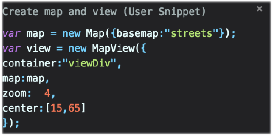

<!-- .slide: data-background="reveal.js/img/bg-1.png" -->
<!-- .slide: class="title" -->
 
 
## Webinar: Tips and Tricks for Developing and Debugging Apps
Kelly Hutchins and Heather Gonzago

----

Ever have one of those days where nothing seems to work? 

----

You keep staring at the same code, but you have nothing...

----

Debugging tools === Productive programmers

----
### **Things we'll discuss**
 

- Development environment
- ArcGIS API for JavaScript resources 
- Debugging problem code
 - Browser developer tools
 - 3rd party user forums (if you are unsure, others may have already answered)

----

<!-- .slide: data-background="reveal.js/img/bg-3.png" -->
  
## **Set up your development environment**

----

### **Local web server**
 
- Setup IIS (Windows) or Apache (already installed on Mac OSX)
- Visit [http://localhost](http://localhost)
- Some examples include:
 - [Live Server](https://marketplace.visualstudio.com/items?itemName=ritwickdey.LiveServer)
 - [local-web-server](https://www.npmjs.com/package/local-web-server)
 - [http-server](https://www.npmjs.com/package/http-server)

----

### **Code snippets**

- Templates for reuseable code
- [ArcGIS API for JavaScript snippets](https://marketplace.visualstudio.com/items?itemName=Esri.arcgis-jsapi-snippets&ssr=false#overview)
- [Snippet generator](https://pawelgrzybek.com/snippet-generator/)
- Emmett
 - Save keystrokes
 - HTML, CSS abbreviations
 - [Plug-in page](https://emmet.io/download/)

----

### **Code Assist**
 

- Much easier to code
- via TypeScript or
- JavaScript using Babel

----

<!-- .slide: data-background="reveal.js/img/bg-3.png" -->

## **Demo: Code Assist**

----

<!-- .slide: data-background="reveal.js/img/bg-3.png" -->
  
## **Troubleshooting your web application**

----

### **Narrow down the problem**

Debugging tools can help determine:
- Is it code-related?
- Client or server-side issue?
- Is there a network issue?
- Is the issue with the data?

----

<!-- .slide: data-background="reveal.js/img/bg-3.png" -->
  
## **Browser Dev Tools: Code issues**

----

- Modules out

----

### **Debugging:  Breakpoints**

 

 
  

- Various ways to pause code
- Debugger;
- Blackboxing

----

### ** Debugging: Network requests**

 

- Records all network requests
- Helps in troubleshooting, e.g.
  - Printing issues
  - Queries

----

### **Dev Tool Workspaces**

- <a href="https://developers.google.com/web/tools/setup/setup-workflow" target="_blank">FileSystem tab</a>
  - Targets the dev environment directly
  - Direct access to development project resources
  - Good if want to build a site
- Local overrides
  - Targets remote website = no direct access to dev environment
  - Overrides network resources
  - Persists changes of network resources locally
  - Good for reconstructing websites

----

### **Mobile emulation**

 

 

- Mobile emulation
- Throttling
- Sensors - geolocation

----

### **Custom formatters**

 

- <a href="https://docs.google.com/document/d/1FTascZXT9cxfetuPRT2eXPQKXui4nWFivUnS_335T3U/preview" target="_blank">Controls how object values display</a>
 

----

### **Accessibility**

- Audits
- Color Contrast
- Extensions
- Axe Coconut (similar to Chrome Canary or Firefox nightly)
- Axe a11y extension
- ChromeVox screen reader

----

<!-- .slide: data-background="reveal.js/img/bg-3.png" -->
  
## **JSAPI FAQ**

----

### **Common questions/issues**

- Module Order
- Mixed content errors
- CORS enabled servers
- Use of proxies

- Narrow the problem down
  - App specific
  - API specific
  - Server-side issue
  - Are any 3rd party resources involved?

----

### **3.x to 4.x Feature Matrix**

- Is this functionality in 4.x?
- 4.x equivalency in 3.x?

----

### **when/then**

<pre style="display:inline-block; padding: 5px; margin: 10px auto; width: 75%;"><code data-trim>

</code></pre>
 
Check out our blog -> <a href="https://blogs.esri.com/esri/arcgis/2017/12/14/making-better-promises" target="_blank>">https://blogs.esri.com/esri/arcgis/2017/12/14/making-better-promises</a>

----

### **Extent changed **

 
- <a href="https://community.esri.com/thread/207901-in-4x-how-to-catch-extent-change-event" target="_blank">4.x extent changed event</a> 

<pre style="display:inline-block; padding: 5px; margin: 10px auto; width: 75%;"><code data-trim>
watchUtils.whenFalse(view, 'stationary', function(evt){
  if(!view.stationary){
    watchUtils.whenTrueOnce(view, 'stationary', function(evt){
      console.log(view.extent);
    });
   }
   else {
     watchUtils.whenFalseOnce(view, 'interacting', function(evt){
       console.log(view.extent);
     });
   }
})
</code></pre>

----

### **AGO Assistant**

----

<!-- .slide: data-background="reveal.js/img/bg-rating.png" -->

----
